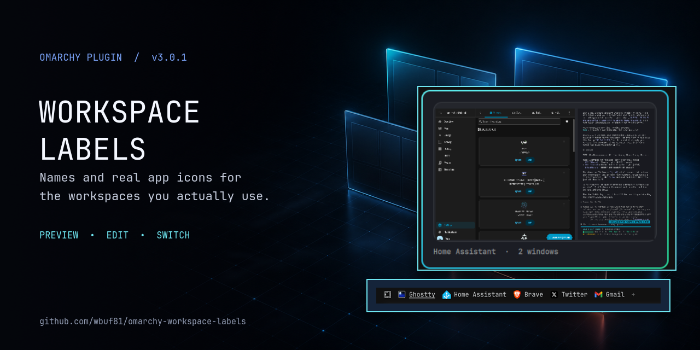
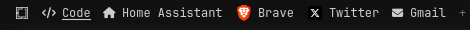
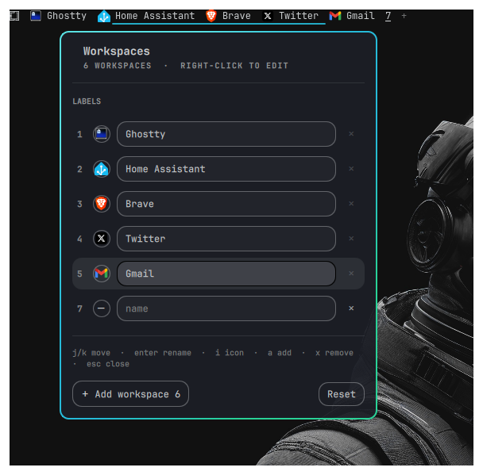
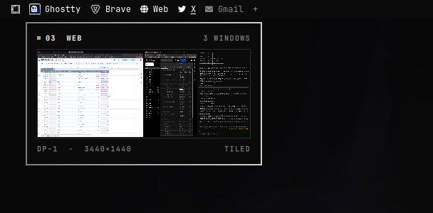
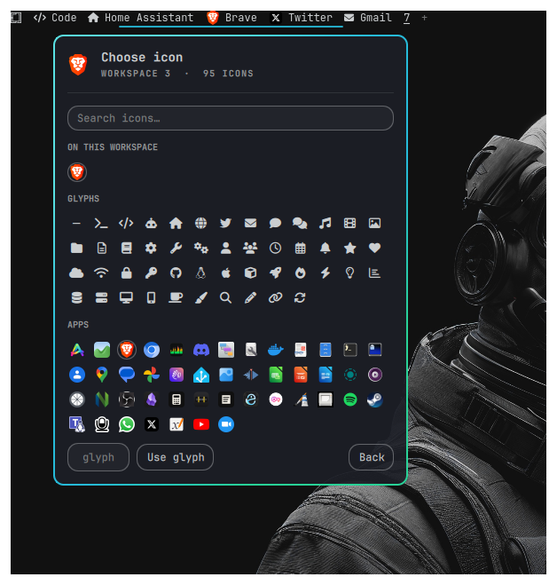

<div align="center">
  

  <br>

  <a href="https://omarchy.org/"></a>
  <a href="https://quickshell.org/"></a>
  <a href="https://github.com/wbuf81/omarchy-workspace-labels/actions"></a>
  <a href="LICENSE"></a>

  <strong>Give the workspaces you actually use a name, an icon, and a face.</strong>
</div>

Stock Omarchy gives you `1 2 3 4 5`. Workspace Labels turns that strip into a
compact, editable map of your desktop: names, Nerd Font glyphs or real app
icons, instant switching, and a hover preview that shows where every window is.

Everything is edited in place. No hand-maintained config file and no shell
restart after changing a label.

<div align="center">
  
</div>

## Why it feels native

- **Built from Omarchy's own UI pieces.** The editor uses `Ui.Panel` and
  `Ui.KeyboardPanel`, so it takes real keyboard focus, clamps and scrolls
  inside the screen, and shares the bar's popout slot correctly.
- **A preview, not a guess.** Hover a workspace to see a scaled map of its
  windows at their actual positions and sizes—even when that workspace is not
  currently visible.
- **Real app icons.** Use the installed Brave, Spotify, or terminal icon rather
  than an approximation. Apps on the workspace being edited are offered first.
- **Fast enough to forget about.** Window captures are single-shot, delayed
  until a deliberate hover, and capped at twelve—not continuously streamed.
- **Keyboard friendly.** Navigate, rename, choose an icon, add, and remove
  without leaving the home row.
- **Theme and layout aware.** Horizontal bars show icon and name; vertical bars
  collapse naturally to an icon-first column.
- **State stays local.** Labels and pins live only in this widget's existing
  `shell.json` layout entry. No service, database, or state directory is added.

## See your desktop before you switch

| Edit names and icons in place | Hover to see the real window layout |
| --- | --- |
|  |  |

Hyprland does not render an inactive workspace as one capturable output, so the
preview is assembled from its individual windows. Each window is captured
through Quickshell's toplevel export and placed in monitor coordinates. A tiled
pair still reads as a tiled pair, and floating windows remain stacked above
tiled ones.

## Install

```sh
omarchy plugin add https://github.com/wbuf81/omarchy-workspace-labels.git --enable
omarchy bar move io.github.wbuf81.workspace-labels --section left
```

Requires Hyprland and a Nerd Font. The bundled glyph choices were
render-verified with JetBrainsMono Nerd Font.

Update later with:

```sh
omarchy plugin update io.github.wbuf81.workspace-labels
```

Disable, remove, or return to the stock workspace widget with:

```sh
omarchy plugin disable io.github.wbuf81.workspace-labels
omarchy plugin remove io.github.wbuf81.workspace-labels
omarchy plugin enable omarchy.workspaces
```

Removing the plugin also removes its layout entry, including saved labels and
pins. Nothing is written outside that entry.

## Everyday controls

| Action | Result |
| --- | --- |
| Hover a workspace | Preview its windows after ~0.45 seconds |
| Left-click a workspace | Switch to it |
| Right- or middle-click a workspace | Open the editor on that row |
| Scroll over the widget | Previous or next visible workspace |
| Click `+` | Pin, focus, and name the lowest free workspace |
| `SUPER + ALT + W` | Toggle the editor with the optional binding below |

Inside the editor:

| Key | Action |
| --- | --- |
| `j` `k` or arrows | Move the row cursor |
| `Enter` | Rename the highlighted workspace |
| `i` | Open its icon picker |
| `a` | Add the lowest free workspace |
| `x` | Remove the highlighted empty workspace |
| `Esc` | Leave the picker, then close the panel |

## Adding and removing is deliberately conservative

`+` does not ask Hyprland to invent a permanent workspace object. It reserves
the lowest free slot in the plugin's `pinned` list, switches to it, and opens
the name field. The focused workspace appears immediately, even before its
first window arrives.

Removing a row unpins the slot and forgets only that row's saved label. If the
workspace still contains any window, removal is blocked and the button explains
why. An unpinned live workspace remains in the bar until Hyprland removes it;
an empty row with a saved label remains editable until you remove it.

The plugin can create empty slots 1–20. Real Hyprland workspaces are not capped:
if workspace 37 exists, it still appears and can be labeled.

## Pick an icon that actually belongs there

<div align="center">
  
</div>

The picker includes 49 verified Nerd Font glyphs and every installed desktop
application with an icon. Its **ON THIS WORKSPACE** row matches each running
window class against the desktop entry's `StartupWMClass`. That indirection
matters: Brave's window class is `brave-browser`, while its desktop icon is
`brave-desktop`.

Application icons are stored as `app:<icon-name>`:

```sh
omarchy bar set io.github.wbuf81.workspace-labels labels \
  '{"3":{"icon":"app:brave-desktop","name":"Brave"}}' --json
```

A web page opened as an ordinary browser tab has no independent desktop entry,
so the picker correctly offers the browser icon. Install it as an Omarchy web
app to give it its own launcher, class, and icon:

```sh
omarchy webapp install "Gmail" https://mail.google.com/ <icon-url-or-file>
```

`icon` also accepts an absolute path such as
`app:/home/you/icons/thing.png`; paste it into the picker's glyph field.

## Settings and scripting

Settings are stored inline under this widget's layout entry in
`~/.config/omarchy/shell.json` and update live.

| Key | Type | Meaning |
| --- | --- | --- |
| `labels` | object | Workspace number to `{icon, name}`. `icon` is a glyph or `app:<icon-name>`. |
| `hoverPreview` | boolean | Single-shot hover previews; default `true`. |
| `pinned` | array | Empty workspace numbers kept in the bar; managed by add/remove. |
| `minWorkspaces` | integer | Legacy fallback that seeds `1..N` only while `pinned` is unset. |

```sh
omarchy bar set io.github.wbuf81.workspace-labels labels \
  '{"1":{"icon":"","name":"Code"}}' --json
omarchy bar set io.github.wbuf81.workspace-labels pinned '[1,2,3,4,5]' --json
```

IPC endpoints make the same interactions bindable and scriptable:

```sh
omarchy-shell io.github.wbuf81.workspace-labels toggleEditor  # also: toggle/open/close
omarchy-shell io.github.wbuf81.workspace-labels openFor 3
omarchy-shell io.github.wbuf81.workspace-labels picker 3
omarchy-shell io.github.wbuf81.workspace-labels add
omarchy-shell io.github.wbuf81.workspace-labels remove 6
omarchy-shell io.github.wbuf81.workspace-labels next
omarchy-shell io.github.wbuf81.workspace-labels prev
omarchy-shell io.github.wbuf81.workspace-labels preview 3
omarchy-shell io.github.wbuf81.workspace-labels unpreview
omarchy-shell io.github.wbuf81.workspace-labels reset
```

For a keyboard toggle, add this to `~/.config/hypr/bindings.lua`:

```lua
o.bind("SUPER + ALT + W", "Workspace labels", "omarchy-shell io.github.wbuf81.workspace-labels toggleEditor")
```

On multiple monitors, the editor opens only on the bar instance you invoked,
matching Omarchy's built-in wifi, clock, and volume panels.

## Edge cases already handled

| Situation | Behavior |
| --- | --- |
| Two rapid add clicks | The second sees staged state and selects the next free slot. |
| Duplicate or malformed pinned IDs | Invalid, fractional, negative, duplicate, and out-of-range entries are ignored. |
| All slots 1–20 occupied or pinned | Add hides/disables instead of producing an invalid workspace. |
| Remove an occupied workspace | No state changes; the row remains protected. |
| Remove an unpinned saved-label row | Only that label is forgotten. |
| Application with several windows | Occupancy and preview use the complete Hyprland toplevel registry. |
| Workspace above slot 20 | Live workspace still appears; only empty user-created slots are capped. |
| Empty icon and name | Bar falls back to the workspace number, so the button remains clickable. |
| External `shell.json` edit | Pending local state expires, allowing the external value to win. |
| Editor and hover preview collide | Editor owns the popout slot and dismisses the preview. |
| Pathological window count | Preview captures at most twelve windows. |

## Local development

Omarchy intentionally rejects plugin symlinks. From an existing local checkout,
use the copy-and-rescan helper:

```sh
./scripts/dev-sync.sh --enable  # first run
./scripts/dev-sync.sh           # after later edits
```

If the shell watcher reports a change but the widget still looks stale, run
`omarchy restart shell`. The watcher log confirms detection, not necessarily a
successful live QML reconstruction.

## Validate and test

Workspace selection and add/remove transitions live in `Logic.js`, the same
module imported by the QML widget. They run under Node without a compositor.

```sh
./scripts/static-check.sh   # manifest, assets, QML parse, scripts, state tests
./scripts/release-check.sh  # all of the above + Omarchy's native validator
```

GitHub Actions runs the portable suite on every push and pull request. The
native validator and interactive checks intentionally run on an Omarchy
machine.

Before a release, manually sanity-check:

- add from a gap (`1, 2, 4` should create `3`) and add twice rapidly;
- add when every slot through 20 is present and confirm no `+` remains;
- remove a pinned empty workspace and an unpinned row with only a saved label;
- try to remove tiled, floating, and multi-window occupied workspaces;
- close the last window, then remove the now-empty workspace;
- rename and change icons rapidly, restart the shell, and confirm persistence;
- preview one-window, tiled, floating, and multi-window workspaces;
- test one horizontal and one vertical bar;
- test each connected monitor, then disable, re-enable, update, and remove.

## How it fits together

| File | Responsibility |
| --- | --- |
| `Workspaces.qml` | Bar widget, editor, icon picker, previews, persistence, and IPC |
| `Logic.js` | Tested normalization, visible/editor unions, and add/remove transitions |
| `manifest.json` | Omarchy metadata, defaults, settings schema, and entry point |
| `tests/logic.test.js` | Executable workspace-state regression coverage |
| `scripts/static-check.sh` | Portable CI and release-asset checks |
| `scripts/release-check.sh` | Native Omarchy validation plus the portable suite |

## Contributing

Bug reports, workflow ideas, unusual monitor setups, and pull requests are
welcome. See [CONTRIBUTING.md](CONTRIBUTING.md) for the development loop and
design principles. Changes are tracked in [CHANGELOG.md](CHANGELOG.md), and
release/architecture handoff details live in
[MAINTAINER_NOTES.md](MAINTAINER_NOTES.md).

## Share it

The repository-ready 1280×640 card lives at
[`docs/social-preview.png`](docs/social-preview.png). Upload it under
**GitHub → Settings → General → Social preview**.

The atmospheric workspace layer was generated for this project. The bar and
hover preview shown on top are crops of the real running plugin. Rebuild the
composite with `./scripts/build-social-card.sh` after updating screenshots.

## Third-party and license

No third-party code is bundled. At runtime the plugin uses Omarchy's
Quickshell configuration (`qs.Ui`, `qs.Commons`) and Quickshell itself.

Glyphs come from the configured Nerd Font; app icons come from desktop entries
and icon themes already installed on the machine. Neither is redistributed.
Application logos in screenshots are trademarks of their respective owners and
appear only to demonstrate behavior.

[MIT](LICENSE) © 2026 Wes.
